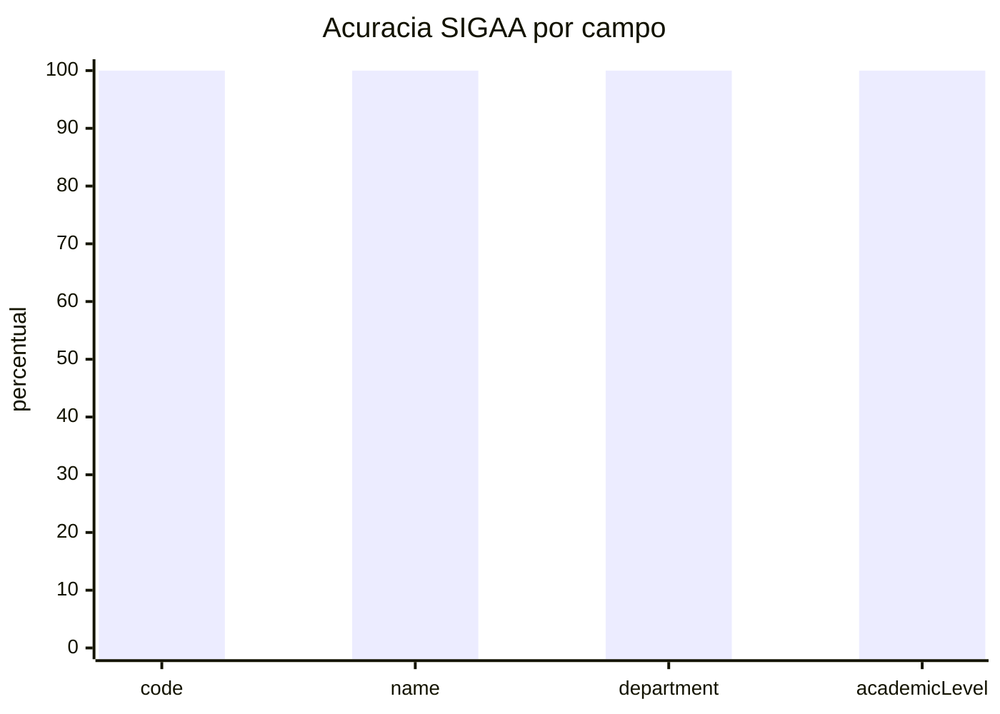

# SIGAA - Resumo para Slides (Defesa)

## 1) Escopo Validado

| Fonte | Tipo | Nivel | Itens extraidos |
|---|---|---|---:|
| DCC (1114) | Departamento | Graduacao | 133 |
| DCI (2440) | Departamento | Graduacao | 32 |
| PGCOMP (1820) | Programa | Mestrado | 70 |
| **Total** | - | - | **235** |

## 2) Acuracia Positiva (amostra estratificada, n=15)

| Campo | Acertos | Total | Percentual |
|---|---:|---:|---:|
| code | 15 | 15 | 100% |
| name | 15 | 15 | 100% |
| department | 15 | 15 | 100% |
| academicLevel | 15 | 15 | 100% |

## 3) Grafico rapido (ASCII)

```text
code          [####################] 100%
name          [####################] 100%
department    [####################] 100%
academicLevel [####################] 100%
```

## 4) Grafico para Markdown/Mermaid



## 5) Mensagem curta para apresentacao oral

- O fluxo JSF stateful do SIGAA foi reproduzido com sucesso para DCC, DCI e PGCOMP.
- O parser foi refinado para cenarios reais (incluindo codigos com prefixo de programa).
- Na avaliacao positiva estratificada, todos os campos criticos atingiram 100% de acerto.

## 6) Artefatos de apoio

- Matriz de casos reais: ementas-docs/SIGAA_REAL_CASE_MATRIX.md
- Relatorio final: ementas-docs/SIGAA_ACCURACY_FINAL_REPORT_2026-05-04.md
- Resultado estruturado (JSON): ementas-api/src/tests/fixtures/sigaa/accuracy-results.json


